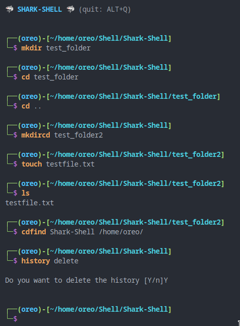

# Shark-Shell 🦈

Shark-Shell is a user-friendly shell with powerful features and a refined design. It provides an intuitive user interface and an aesthetic layout that enhances the user experience, making working with the computer system a pleasant journey.



## Features

- **Powerful:** Shark-Shell offers a wide range of powerful features for efficient interaction with the computer system. From basic commands to advanced scripting capabilities, the shell provides everything you need to be productive.

- **Intuitive User Interface:** The carefully designed user interface of Shark-Shell ensures user-friendliness. It is easy to use and allows effortless navigation between different commands and functions.

- **Beautiful Design:** Shark-Shell boasts an aesthetically appealing design crafted with care. With a modern and minimalist approach, the shell creates a pleasant working environment.

- **Customizability:** Shark-Shell allows customization of design and settings according to your preferences. You can adjust color schemes, fonts, and other visual elements to tailor the shell to your individual needs.

## Installation

To install Shark-Shell on your system, follow these steps:

1. Clone or download the Shark-Shell repository.

   ```shell
   git clone https://github.com/ReLoading-15/Shark-Shell.git
   ```

2. Navigate to the "Shark-Shell" directory.

   ```shell
   cd Shark-Shell
   ```

## Usage

Once Shark-Shell is installed, you can use it as follows:

1. Open the shell by entering "sharkshell" in your terminal.

2. The user interface will appear, and you can enter commands and interact with the shell.

3. Utilize the built-in features and commands to accomplish your tasks. The shell provides extensive documentation and help to assist you in usage.

4. Press ```ALT + Q``` to quit the shell (to terminate processes within the shell, press ```CTRL + C```). 

### Additional Commands

- **cdfind** *foldername* <*root*>: Search for a folder with the name *foldername* and change the directory to the first folder found with this name. If root is not given, the search starts from */home/*.

- **mkdircd** *foldername*: Creates a folder with the name *foldername* and immediately navigates to the newly created folder.

- **history**:
  - **show**: Displays the command history.
  - **delete**: Deletes the command history.

If you would like to contribute to the project, please read the Contributing guidelines and submit your pull requests.

## License

This project is licensed under the [MIT License](https://opensource.org/licenses/MIT). For more information, see the LICENSE file.